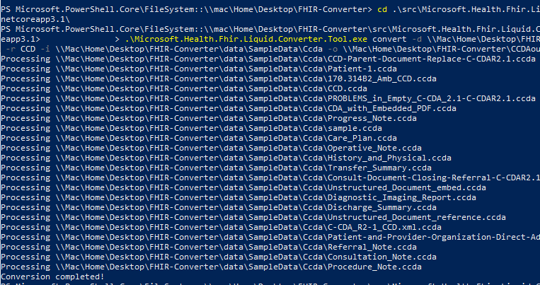

# FHIR Converter

FHIR Converter is an open source project that enables conversion of health data from legacy formats to FHIR.

The first version of the FHIR Converter released to open source on Mar 6th, 2020. It used Handlebars template language and Javascript runtime. A new converter engine was released on Nov 13, 2020 that uses Liquid templating language and .Net runtime.

Currently, Microsoft supports two types of converter engines, Handlebars engine and Liquid engine, along with templates and filters. **We strongly recommend using the Liquid converter** for a better alignment with [Azure Healthcare APIs](https://docs.microsoft.com/azure/healthcare-apis/), [Azure API for FHIR](https://azure.microsoft.com/services/azure-api-for-fhir/), [FHIR Server for Azure](https://github.com/microsoft/fhir-server), and [Microsoft Logic Apps](https://azure.microsoft.com/services/logic-apps/).

The following table shows the differences between two converter engines:

|  | Handlebars engine | Liquid engine | 
| ----- | ----- | ----- |
| **Template language** | [Handlebars](https://handlebarsjs.com/) | [Liquid](https://shopify.github.io/liquid/) |
| **Template authoring tool** | Self-hosted web-app | [VS Code extension](https://marketplace.visualstudio.com/items?itemName=ms-azuretools.vscode-health-fhir-converter)|
| **Supported conversions** | 1. HL7v2 to FHIR <br> 2. C-CDA to FHIR | 1. HL7v2 to FHIR <br> 2. C-CDA to FHIR <br> 3. JSON to FHIR **(new!)** |
| **Available as** | 1. Self-deployed web service <br> (on-prem or on Azure)| 1. Command line tool <br> 2. $convert-data operation in  [FHIR Server for Azure (OSS)](https://github.com/microsoft/fhir-server/blob/main/docs/ConvertDataOperation.md) <br> 3. $convert-data operation in both [Azure API for FHIR](https://docs.microsoft.com/azure/healthcare-apis/azure-api-for-fhir/convert-data) and [Azure Healthcare APIs (preview)](https://docs.microsoft.com/azure/healthcare-apis/fhir/convert-data)|

⚠ Rest of this document is about the Liquid converter. For the Handlebars converter, please refer to the [Handlebars branch](https://github.com/microsoft/FHIR-Converter/tree/handlebars).

Currently, FHIR Converter supports three types of conversions, **HL7v2 to FHIR**, **C-CDA to FHIR**, and **JSON to FHIR**. The converter uses templates that define mappings between these different data formats. The templates are written in [Liquid](https://shopify.github.io/liquid/) templating language and make use of custom [filters](docs/Filters-and-Tags.md).

The converter comes with a few ready-to-use templates. If needed, you can create a new template, or modify existing templates to meet your specific conversion requirements.

FHIR Converter with DotLiquid engine transforms the input data into FHIR bundles that are persisted to a FHIR server. The converter is integrated into both [Azure API for FHIR](https://docs.microsoft.com/azure/healthcare-apis/azure-api-for-fhir/) and [Azure Healthcare APIs (preview)](https://docs.microsoft.com/azure/healthcare-apis/), as well as in the open-source [FHIR Server](https://github.com/microsoft/fhir-server) as a [`$convert-data` operation](#using-convert-data-in-fhir-server). It is also available as a [command line tool](#using-command-line-tool).

## Using $convert-data in FHIR server

The `$convert-data` operation is integrated into both Azure API for FHIR and FHIR server to run as part of the service. After enabling `$convert-data` in your server, you can make API calls in the form of ```<<your FHIR server URL>>/$convert-data``` to the server to convert your data into FHIR. In the API call request body, you would include parameters such as `inputData`, `inputDataType`, `templateCollectionReference`, and `rootTemplate`, to specify the message and the type of message you are converting. 

For more information on configuring and using `$convert-data` operation on your server, please refer to these documentation:

- [$convert-data for Azure API for FHIR](https://docs.microsoft.com/azure/healthcare-apis/azure-api-for-fhir/convert-data)
- [$convert-data for Azure Healthcare APIs](https://docs.microsoft.com/azure/healthcare-apis/fhir/convert-data)
- [$convert-data for FHIR Server](https://github.com/microsoft/fhir-server/blob/main/docs/ConvertDataOperation.md)

## Using Command line tool

### Supported parameters

The command line tool is another way of converting data, as well as managing templates. The tool converts a folder containing input messages (HL7v2, C-CDA, or JSON) into FHIR resources. It accepts the following parameters in the command line:

| Option | Name | Optionality | Default | Description |
| ----- | ----- | ----- |----- |----- |
| -d | TemplateDirectory | Required | | Root directory of templates. |
| -r | RootTemplate | Required | | Name of root template.<br><br> **HL7v2 to FHIR**: "ADT_A01", "ADT_A02", "ADT_A03", "ADT_A04", "ADT_A05", "ADT_A08", "ADT_A11",  "ADT_A13", "ADT_A14", "ADT_A15", "ADT_A16", "ADT_A25", "ADT_A26", "ADT_A27", "ADT_A28", "ADT_A29", "ADT_A31", "ADT_A47", "ADT_A60", "OML_O21", "ORU_R01", "ORM_O01", "VXU_V04", "SIU_S12", "SIU_S13", "SIU_S14", "SIU_S15", "SIU_S16", "SIU_S17", "SIU_S26", "MDM_T01", "MDM_T02" <br><br> **C-CDA to FHIR**: "CCD", "ConsultationNote", "DischargeSummary", "HistoryandPhysical", "OperativeNote", "ProcedureNote", "ProgressNote", "ReferralNote", "TransferSummary" <br><br> **JSON to FHIR**: "Stu3ChargeItem", "ExamplePatient" <br> (*These JSON templates are sample templates for use, not default templates that adhere to any pre-defined JSON message types. JSON does not have any standardized message types, unlike HL7v2 messages or C-CDA documents. Therefore, instead of "default" templates we provide you with some sample templates that you can use as a starting guide for you to modify and customize.*)  |
| -c | InputDataContent | Optional| | Input data content. Specify OutputDataFile to get the results. |
| -n | InputDataFile | Optional| | Input data file. Specify OutputDataFile to get the results. |
| -f | OutputDataFile | Optional | | Output data file. |
| -i | InputDataFolder | Optional | | Input data folder. Specify OutputDataFolder to get the results. |
| -o | OutputDataFolder | Optional | | Output data folder. |
| -t | IsTraceInfo | Optional | | Provide trace information in the output if "-t" is set. **This parameter is only supported in HL7v2 to FHIR conversion.** |
| --version | Version | Optional | | Display version information. |
| --help | Help | Optional | | Display usage information of this tool. |

### Command line example

First, build the executable file, `Microsoft.Health.Fhir.Liquid.Converter.Tool.exe`, in your local directory. Have the input data, as well as the conversion templates, saved in separate folders.

#### Converting data inside folders

You can run the built .exe file in your terminal by running the following command line and specifying the directories:

```
>.\Microsoft.Health.Fhir.Liquid.Converter.Tool.exe convert -d myTemplateDirectory -r myRootTemplate -i myInputDataFolder -o myOutputDataFolder
```

For example, you can run a command like below to convert all C-CDA sample documents inside the `SampleData\Ccda` folder using the default `CCD` template:

```
>.\Microsoft.Health.Fhir.Liquid.Converter.Tool.exe convert -d {path}\Templates\Ccda -r CCD -i {path}\SampleData\Ccda -o {path to your output folder}
```

After running the command line, there will be a series of "Processing..." lines being written in the terminal window. When the conversion is complete, you will see "Conversion completed!" message.

For example, if you were doing the C-CDA to FHIR conversion in a folder as in the command above, you will see something like this:



#### Converting individual files

Instead of converting multiples messages and documents inside a folder, you can also convert single files using the parameters in the table above. For example, if you were to convert a C-CDA document into a FHIR resource using the `CCD` template:
```
>.\Microsoft.Health.Fhir.Liquid.Converter.Tool.exe convert -n {path}\SampleData\Ccda\CCD.ccda -d {path}\Templates\Ccda -f {path to your output json file} -r CCD
```

## Using Templates

The command line tool supports managing different versions of templates from Azure Container Registry (ACR). You can customize templates and store them in your ACR if default templates are not sufficient for meeting conversion requirements. After [ACR authentication](docs/TemplateManagementCLI.md#authentication), you can pull templates from ACR or push templates to ACR using our command line tool.

> Note: Template version is aligned with the version of FHIR Converter.

### Command line example

Example command to push a collection of templates to ACR image from a folder:
```
>.\Microsoft.Health.Fhir.Liquid.Converter.Tool.exe push testacr.azurecr.io/templatetest:default myInputFolder
```
Example usage of pulling an image of templates in a folder:
```
>.\Microsoft.Health.Fhir.Liquid.Converter.Tool.exe pull testacr.azurecr.io/templatetest@sha256:412ea84f1bb1a9d98345efb7b427ba89616ec29ac332d543eff9a2161ca12a58 myOutputFolder
```

For more details on how to push and pull template collections, please refer to the documentation on [Template Management CLI tool](docs/TemplateManagementCLI.md).

To see the current version of templates we support, check out the complete list of [templates](data/Templates).

There are other versions released by Microsoft that are stored in a public ACR `healthplatformregistry.azurecr.io`. You can directly pull templates from ``` healthplatformregistry.azurecr.io/hl7v2defaulttemplates:<version> ``` without ACR authentication.

## Resource ID generation

The default templates provided with the Converter computes Resource IDs using the input data fields. In order to preserve the generated Resource IDs, the converter creates **PUT requests**, instead of POST requests in the generated bundles.

For **HL7v2 to FHIR conversion**, [HL7v2 DotLiquid templates](data/Templates/Hl7v2/ID) help generate FHIR resource IDs from HL7v2 messages. An ID generation template does three things: 1) extract identifiers from the input segment or field; 2) combine the identifers with resource type and base ID (optional) as hash seed; 3) compute hash as output ID.

For **C-CDA to FHIR conversion**, [C-CDA DotLiquid templates](data/Templates/Ccda/Utils) generate FHIR resource IDs in two ways: 1) [ID generation template](data/Templates/Ccda/Utils/_GenerateId.liquid) helps generate Patient ID and Practitioner ID; 2) the resource IDs for other resources are generated from the resource object directly.

For **JSON to FHIR conversion**, there is no standardized JSON input message types unlike HL7v2 messages or C-CDA documents. Therefore, instead of default templates we provide you with some sample JSON DotLiquid templates that you can use as a starting guide for your custom JSON conversion templates. You can decide how to generate the resource IDs according to your own inputs, and use our sample templates as a reference.

The Converter introduces a concept of "base resource/base ID". Base resources are independent entities, like Patient, Organization, Device, etc, whose IDs are defined as base ID. Base IDs could be used to generate IDs for other resources that relate to them. It helps enrich the input for hash and thus reduce ID collision.
For example, a Patient ID is used as part of hash input for an AllergyIntolerance ID, as this resource is closely related with a specific patient.

Below is an example where an AllergyIntolerance ID is generated, using ID/AllergyIntolerance template, AL1 segment and patient ID as its base ID.
The syntax is ``.

```liquid

```

## Resource validation and post-processing

The output of converter depends on the templates as well as the quality and richness of input messages. Therefore, it is important that you review and validate the Converter output before using those in production.

In general, you can use [HL7 FHIR validator](https://wiki.hl7.org/Using_the_FHIR_Validator) to validate a FHIR resource. You may be able to fix some of the conversion issues by appropriately changing the templates. For other issues, you may need to have a post-processing step in your pipeline.

In some cases, due to lack of field level data in the incoming messages, the Converter may produce resources without useful information or even without ID. You can use `Hl7.Fhir.R4` .NET library to filter such resources in your pipeline. Here is the sample code for such purpose.

```C#
using Hl7.Fhir.Model;
using Hl7.Fhir.Serialization;
using System;
using System.Collections.Generic;
using System.Linq;

public class PostProcessor
{
    private readonly FhirJsonParser _parser = new FhirJsonParser();

    public IEnumerable<Resource> FilterResources(IEnumerable<string> fhirResources)
    {
        return fhirResources
            .Select(fhirResource => _parser.Parse<Resource>(fhirResource))
            .Where(resource => !IsEmptyResource(resource))
            .Where(resource => !IsIdAbsentResource(resource));
    }

    public bool IsEmptyResource(Resource resource)
    {
        try
        {
            var fhirResource = resource.ToJObject();
            var properties = fhirResource.Properties().Select(property => property.Name);
            // an empty resource contains no properties other than "resourceType" and "id"
            return !properties
                .Where(property => !property.Equals("resourceType"))
                .Where(property => !property.Equals("id"))
                .Any();
        }
        catch (Exception e)
        {
            Console.Error.WriteLine(e.Message);
            // deal with the exception...
        }

        return false;
    }

    public bool IsIdAbsentResource(Resource resource)
    {
        try
        {
            return string.IsNullOrWhiteSpace(resource.Id);
        }
        catch (Exception e)
        {
            Console.Error.WriteLine(e.Message);
            // deal with the exception...
        }
        return false;
    }
}
```

## Reference documentation

- [Filters summary](docs/Filters-and-Tags.md)
- [Snippet concept](docs/SnippetConcept.md)

## External resources

- [DotLiquid wiki](https://github.com/dotliquid/dotliquid/wiki)
- [HL7 Community 2-To-FHIR-Project](https://confluence.hl7.org/display/OO/2-To-FHIR+Project)
 
## Contributing

This project welcomes contributions and suggestions.  Most contributions require you to agree to a
Contributor License Agreement (CLA) declaring that you have the right to, and actually do, grant us
the rights to use your contribution. For details, visit [the CLA site](https://cla.opensource.microsoft.com).

When you submit a pull request, a CLA bot will automatically determine whether you need to provide
a CLA and decorate the PR appropriately (e.g., status check, comment). Simply follow the instructions
provided by the bot. You will only need to do this once across all repos using our CLA.

This project has adopted the [Microsoft Open Source Code of Conduct](https://opensource.microsoft.com/codeofconduct/).
For more information see the [Code of Conduct FAQ](https://opensource.microsoft.com/codeofconduct/faq/) or
contact [opencode@microsoft.com](mailto:opencode@microsoft.com) with any additional questions or comments.
