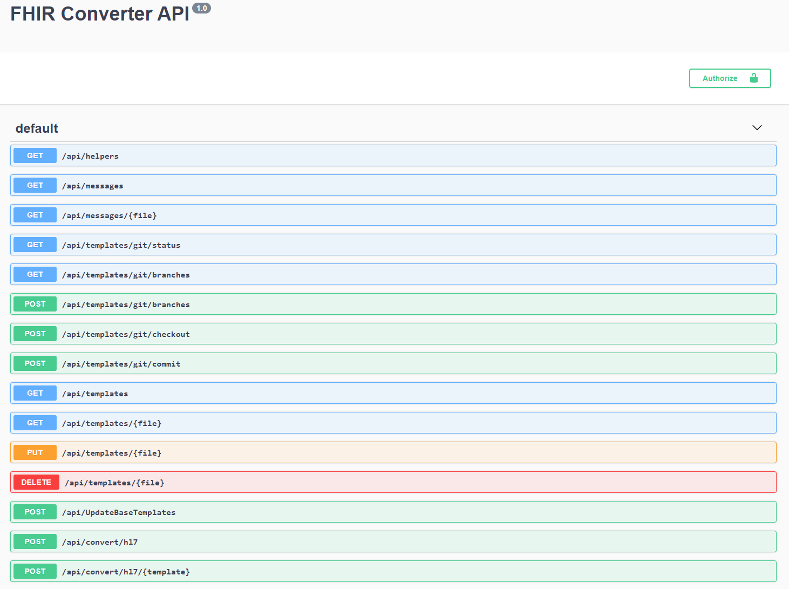

# APIs

Under the API tab on the main page of the web UI, you can see the list of all available Get, Post, Put, and Delete functions. For each of the APIs below, you can click on the row to see details about the API, view the parameters required, and test out the API.

The API is secured using an API Key.

## API Details

| Function | Syntax                    | Details                                         |
|----------|---------------------------|-------------------------------------------------|
|GET       |/api/helpers               |Lists available template helpers                 |
|GET       |/api​/messages              |Lists available HL7 v2 messages                  |
|GET       |/api/messages/{file}       |Returns a specific HL7 test message              |
|GET       |/api/templates/git/status  |Lists uncommitted changes                        |
|GET       |/api​/templates​/git​/branches|Lists of branches                                |
|POST      |/api​/templates​/git​/branches|Create new branch (from head)                    |
|POST      |/api/templates/git/checkout|Checkout branch                                  |
|POST      |/api/templates/git/commit  |Commit ALL changes                               |
|GET       |/api​/templates             |Lists available templates                        |
|GET       |/api/templates/{file}      |Returns a specific template                      |
|PUT       |/api/templates/{file}      |Stores a template in the template store          |
|DELETE    |/api​/templates​/{file}      |Deletes a template                               |
|POST      |/api/UpdateBaseTemplates   |Updates base templates (deletes existing data). This should be used only when latest version of templates needs to be pulled.
|POST      |/api/convert/hl7           |Converts an HL7 v2 message to FHIR using a template directly from the end point|
|POST      |/api/convert/hl7/{template}|Converts an HL7 v2 message to FHIR using a template from storage|
