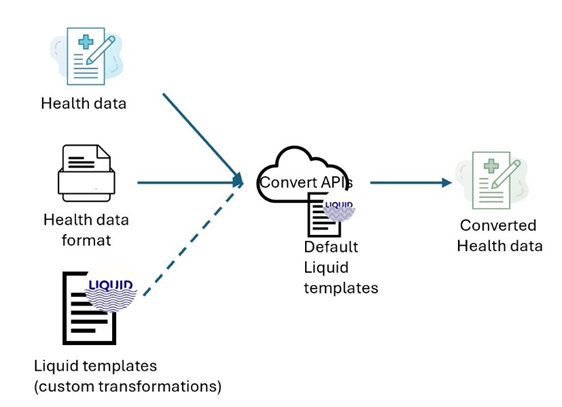

# FHIR Converter Overview

The FHIR converter enables healthcare record format conversion scenarios from various source formats (such as Hl7v2, CCDA, Json, FHIR STU3) to destination formats (such as FHIR R4) using Liquid templates (to specify the transformation rules to be applied).

The latest offering provides REST based APIs to perform conversion requests.

## API summary

The conversion APIs process the provided input data of the specified format and use the specified Liquid template (default or custom) and return the converted result as per the transformations in the template.

## Release

### As a container

The FHIR converter APIs are being offered as a container artifact in [Microsoft Container Registry](https://github.com/microsoft/containerregistry).
This image can be downloaded and run as a web service on a container hosting platform in your Azure tenant; that clients can target for conversion requests.

