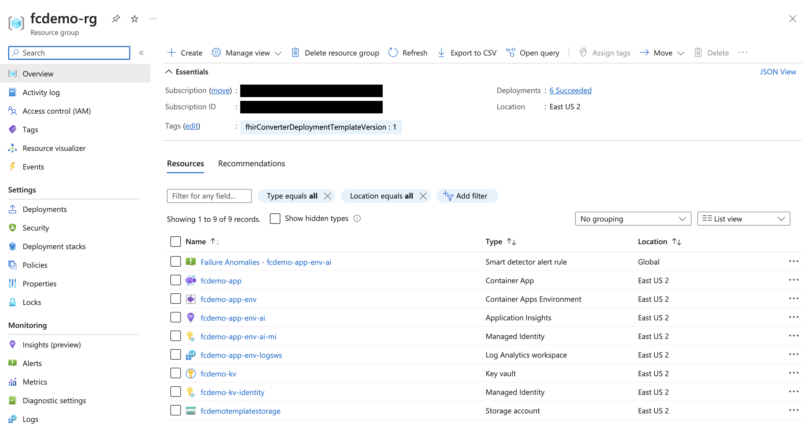

# Deployment options to set up FHIR converter service in Azure

This article details various deployment options for provisioning a FHIR converter service in Azure using the [MCR container image](https://mcr.microsoft.com/en-us/product/healthcareapis/fhir-converter/tags).

The following Azure resources will be provisioned once the deployment has completed:

* 1 x Container Apps Environment
* 1 x Azure Container App
* 1 x Log Analytics Workspace
* 1 x App Insights
* 1 x Storage Account
* 1 x Key Vault



## Prerequisites

To run any of these deployment options, the following items must be set up before execution:
 
* Contributor and User Access Administrator OR Owner permissions on your Azure subscription
 
For local deployments (Options 2 and 3), the following additional steps must be performed:
 
* Install the [Azure CLI](https://learn.microsoft.com/en-us/cli/azure/install-azure-cli) module
 
* Log into your Azure account:
 
```PowerShell
az login 
```
 
* If you have more than one subscription, select the subscription you would like to deploy to:
 
```PowerShell
az account set --subscription <SubscriptionId>
```
 
* Clone this repo and navigate to the Bicep deployment folder:
 
```PowerShell
git clone https://github.com/microsoft/FHIR-Converter.git
cd docs/deploy
```

## Deployment

### Deployment settings

The deployment options below provide a quickstart version which will set up your service with the default configuration, which is typically intended for testing or initial setup. The deployment options also allow for specifying specific configurations as needed for your service, during deployment.

Note: You are also able to update the service configuration post initial deployment, by redeploying with the updated settings.

#### Default settings

* **Security** - Security settings for the API endpoints are disabled by default. It is **strongly recommended** to enable security for your FHIR converter service.
* **Template store integration** - Template store integration is disabled by default. When template store integration is disabled, a Storage Account will not be provisioned with the deployment.
* **Default templates only** - When template store integration is disabled, the FHIR converter service will only have access to the provided default templates, with no access to custom templates.
* **Application Insights** - Application Insights is enabled by default. Application Insights will receive application logs and metrics for the FHIR converter service to be used for debugging/monitoring.

See [Parameters](#parameters) for details on the parameters that can be use to configure the deployment. 

#### Configurable settings

See [Parameters](#parameters) for details on the parameters that can be used to configure the deployment. To learn more about the various options available to customize your service, and to configure the settings of your FHIR converter service in Azure, refer [Configure FHIR converter service settings](configuration-settings.md).

#### Parameters

The table below outlines the parameters that can be configured through any of the 3 deployment options:

| Parameter | Type | Required | Description | Default Value |
| --- | --- | --- | --- | --- |
| serviceName | string | Yes | Used to generate a name for each of the resources provisioned wherever a name is not specified. | N/A |
| containerAppImageTag | string | Yes | The tag of the FHIR converter image version to be pulled from MCR. Visit the [FHIR converter MCR page](https://mcr.microsoft.com/en-us/product/healthcareapis/fhir-converter/tags) to see available image tags. | N/A |
| location | string | Yes | The Azure region where the resources will be deployed. See [region availability](https://azure.microsoft.com/en-us/explore/global-infrastructure/products-by-region/?products=key-vault,monitor,storage,container-apps) for the relevant resources to select a valid location. | N/A |
| timestamp | string | No | A timestamp to append to each deployment name to make it unique. | current date-time in 'yyyyMMddHHmmss' format |
| resourceGroupName | string | No | The name of the Resource Group where the resources will be deployed. | serviceName + "-rg" |
| containerAppEnvName | string | No | The name of the Container Apps environment. | serviceName + "-app-env" |
| containerAppName | string | No | The name of the Azure Container App to run the FHIR converter. | serviceName + "-app" |
| minReplicas | int | No | The minimum number of replicas for the Azure Container App. | 0 |
| maxReplicas | int | No | The maximum number of replicas for the Azure Container App. | 30 |
| cpuLimit | string | No | The CPU limit for the Azure Container App. | "1.0" |
| memoryLimit | string | No | The memory limit for the Azure Container App. | "2Gi" |
| templateStoreIntegrationEnabled | boolean | No | Enable or disable template store integration for the FHIR converter service. If disabled, only default templates can be used for conversion. If enabled, the necessary storage resources will be deployed only custom templates can be used. | false |
| templateStorageAccountName | string | No | The name of the Storage Account to store custom templates. | serviceName + "templatestorage" |
| templateStorageAccountContainerName | string | No | The name of the Storage Blob Container to store custom templates. | serviceName + "templatecontainer" |
| applicationInsightsEnabled | boolean | No | Enable or disable Application Insights deployment for your service. If enabled, the necessary resources for telemetry export will be deployed. Application metrics and request logs will be unavailable for any time period where Application Insights is disabled. | true |
| keyVaultName | string | No | The name of the Key Vault to store secrets. | serviceName + "-kv" |
| keyVaultUserAssignedIdentityName | string | No | The name of the User-Assigned Managed Identity to be used to access secrets in the Key Vault. | serviceName + "-kv-identity" |
| securityEnabled | boolean | No | Enable or disable security settings for the APIs. | false |
| securityAuthenticationAudiences | array of strings | No | The audiences for the API authentication. If securityEnabled is set to true, this parameter must have a value provided. | empty array |
| securityAuthenticationAuthority | string | No | The authority for the API authentication. If securityEnabled is set to true, this parameter must have a value provided. | empty string |

### Deployment options

#### Option 1: Single-click Deploy to Azure via ARM template generated from Bicep Template

(https://portal.azure.com/#create/Microsoft.Template/uri/https%3A%2F%2Fraw.githubusercontent.com%2Fmicrosoft%2FFHIR-Converter%2Fshared%2Fconvert-api-documentation-update%2Fdocs%2Fdeploy%2FFhirConverter-SingleAzureDeploy.json)

Click the button above to provision the FHIR converter via Azure Portal. This button deploys a [remote ARM template](https://github.com/microsoft/FHIR-Converter/blob/shared/convert-api-documentation-update/docs/deploy/FhirConverter-SingleAzureDeploy.json) generated from the [single Bicep template](https://github.com/microsoft/FHIR-Converter/blob/shared/convert-api-documentation-update/docs/deploy/FhirConverter-SingleAzureDeploy.bicep) entry point for provisioning all necessary Azure resources and role assignments in Option 2.

Refer to [Configurable Settings](#configurable-settings) for more information on the required parameters to be provided and the default values used for optional parameters.

#### Option 2: Deploy a single Bicep file locally

Deploy the [Single Deploy Bicep Template](../deploy/FhirConverter-SingleAzureDeploy.bicep) with the default settings described above by running the following command:

```
az deployment sub create --location <Location> --name <A custom name for your deployment> --template-file FhirConverter-SingleAzureDeploy.bicep
```

See the following command for sample syntax to use when customizing parameter values in your deployment:
```
az deployment sub create --location <Location> --name <A custom name for your deployment> --template-file FhirConverter-SingleAzureDeploy.bicep --parameters containerAppName="<Custom_Container_App_name>"
```

To see a description of a given parameter after being prompted to provide a value, type '?'. Refer to [Configurable Settings](#configurable-settings) for more information on the required parameters to be provided and the default values used for optional parameters.

#### Option 3: Execute a single PowerShell deployment script locally

Run the following command to run the PowerShell deployment script:

```PowerShell
./Deploy-FhirConverterService.ps1
```

See the following command for sample syntax to use when customizing parameter values in your deployment:

```PowerShell
./Deploy-FhirConverterService.ps1 -containerAppName "<Custom_Container_App_name>"
```

This [PowerShell deployment script](../deploy/Deploy-FhirConverterService.ps1) sets up all necessary Azure resources for running the FHIR converter service by deploying Bicep templates via Azure CLI commands.

Refer to [Configurable Settings](#configurable-settings) for more information on the required parameters to be provided and the default values used for optional parameters.

### Redeployment scenarios

The following scenarios will require a redeployment of your service using any one of the above options:

* Update container image tag - If you intend to update your service to use the latest container image tag available, a redeployment will set up your service to pull the correct image tag specified.

* Updated settings - If you choose to update any configuration, a redeployment is required for the changes to take effect. Some examples are:

  * Enable or disable authentication
  * To update authentication audience/authority.
  * Switch to default templates or custom templates usage.
  * To update the Storage Account to pull custom templates from.
  * Enable or disable Application Insights telemetry.

* Custom template collection update - If you add/update any custom template in your Storage Account, a redeployment is required for the service to pick up the latest template collection and use that for conversion. You can redeploy using one of the options above, or manually restart your revision in the Azure Portal. To do the latter, go to your Container App's page in the Azure Portal, navigate to the "Revisions and replicas" blade under "Application", click on your revision name, and at the top of the "Revision Details" pane on the right, click "Restart".

### Additional Deployment Notes

* To view the progress of a deployment, navigate to the resource group in Azure Portal and select the 'Deployments' tab under 'Settings' in the left panel.

* Container App supports [zero downtime deployment](https://learn.microsoft.com/en-us/azure/container-apps/revisions#zero-downtime-deployment).

  In case of updates to the service (image tag, configuration, etc.), a new container revision is created. If there are any issues in setting up the new revision, the endpoint is still available to use using the prior successfully provisioned revision. You can check the status and logs of the failing revision to debug issues with the deployment. Refer [Revisions](https://learn.microsoft.com/en-us/azure/container-apps/revisions) for more information.

## Summary

In this how-to-guide, you learned how to deploy your FHIR converter service in Azure.

Once the deployment is complete, you can use the Azure Portal to navigate to the newly created Azure Container App to see the details of your service.
The default URL to access your FHIR converter service will be the application url of your Container App of the format:`https://<SERVICE NAME>.<ENV UNIQUE ID>.<REGION NAME>.azurecontainerapps.io`.

To get started with your newly deployed FHIR converter service, refer to the following documents:

* [Configure FHIR converter service settings](configuration-settings.md)
* [Use FHIR converter APIs](use-convert-web-apis.md)
