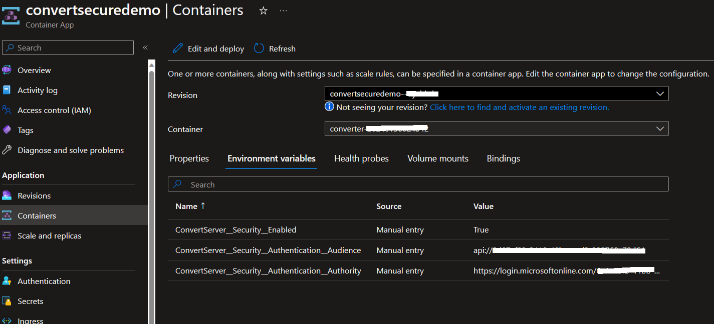

# Azure Active Directory Authentication

This How-to-guide shows you how to configure the authentication settings for the FHIR converter service through Azure. This is needed to ensure restricted access to your FHIR converter APIs, allowing only tokens issued from within your tenant to be able to interact with the APIs.

To complete this configuration, you will:

1. **Create a resource application in Azure AD**: This resource application will be a representation of the FHIR converter service that can be used to authenticate and obtain tokens. In order for an application to interact with Azure AD, it needs to be registered.
1. **Provide app registration details to your Convert web service**: Once the resource application is registered, you will set the authentication configuration of your  FHIR converter web service. This ensures that any client that is able to authenticate with the above resource application will be able to access your  FHIR converter APIs.
1. **Create a service client application in Azure AD**: Client application registrations are Azure AD representations of applications that can be used to authenticate and obtain tokens. A service client is intended to be used by an application to obtain an access token without interactive authentication of a user. It will have certain application permissions and use an application secret (password) when obtaining access tokens.
1. **Retrieve Access Token via Postman or Azure CLI**: With your service client application enabled, you can obtain an access token to authenticate your application.

## Prerequisites

1. This tutorial requires an Azure AD tenant. If you have not created a tenant, see [Create a new tenant in Azure Active Directory](https://docs.microsoft.com/azure/active-directory/fundamentals/active-directory-access-create-new-tenant).

## Authentication Settings Overview

The configurable authentication settings are :

```json
{
  "ConvertService" : {
    "Security": {
      "Enabled":  true,
      "Authentication": {
        "Audience": "",
        "Authority": ""
      }
    }
  }
}
```

| Element                    | Description |
| -------------------------- | --- |
| Enabled                    | Whether or not the service has any security enabled. |
| Authentication:Audience    | Identifies the recipient that the token is intended for. |
| Authentication:Authority   | The issuer of the jwt token. |

## Authentication with Azure AD

### Create a Resource Application in Azure AD for your Convert service

1. Sign into the [Azure Portal](https://ms.portal.azure.com/).
2. Select **Azure Active Directory** > **App Registrations** > **New registration**:
    1. Enter a **Name** for your app registration.
    2. To restrict access to APIs to only your tenant, select **Accounts in this organizational directory only (*tenant name* only - Single tenant)**.
    3. Select **Register**.
3. Select **Expose an API**.
    1. Application ID URI - **Add**. You can specify a URI or use the generated App ID URI. Select **Save**.
    2. Select **Add a Scope**:
        1. In **Scope name**, enter *user_impersonation*.
        2. In the text boxes, add an admin consent display name and admin consent description you want users to see on the consent page. For example, *access my app*.

### Set the Authentication configuration of your FHIR converter service

1. If you have deployed the FHIR converter service to Azure, provide the configuration:
    * If you are using **Deploy-ConvertService** using the powershell scripts (**TODO: insert link to deployment instructions) to deploy your Convert service to an Azure Container App, provide the below params:
        1. **-SecurityEnabled**
        2. **-SecurityAuthenticationAudiences** with the **Application ID URI** created above (also supports multiple audiences).
        3. **-SecurityAuthenticationAuthority** with the tenant your application exists in, for example: ```https://login.microsoftonline.com/<tenant-name>.onmicrosoft.com``` or ```https://login.microsoftonline.com/<tenant-id>```.
    * Alternatively, you can directly provide the configuration via environment variables in your Azure Container App running the  FHIR converter service:
        1. **ConvertService__Security__Enabled** - True
        2. **ConvertService__Security__Authentication__Audiences__0** - the **Application ID URI** created above.
        3. **ConvertService__Security__Authentication__Authority** - the tenant your application exists in, for example: ```https://login.microsoftonline.com/<tenant-name>.onmicrosoft.com``` or ```https://login.microsoftonline.com/<tenant-id>```.

        Refer [Configure environment variables](https://learn.microsoft.com/en-us/azure/container-apps/environment-variables?tabs=portal) for more information.

        

### Create a Service Client Application

1. Select **Azure Active Directory** > **App Registrations** > **New registration**:
    1. Enter a **Name** for your service client. You can provide a **URI** but it typically will not be used.
    1. Select **Register**.
1. Copy the **Application (client) ID** and the **Directory (tenant) ID** for later.
1. Select **API Permissions** to provide your service client permission to your resource application:
    1. Select **Add a permission**.
    1. Under **My APIs**, select the resource application you created above for your Convert Service.
    1. Under **Select Permissions**, select the application roles from the ones that you defined on the resource application.
    1. Select **Add permissions**.
1. Select **Certificates & secrets** to generate a secret for obtaining tokens:
    1. Select **New client secret**.
    1. Provide a **Description** and duration of the secret. Select **Add**.
    1. Copy the secret once it has been created. It will only be displayed once in the portal.

### Get Access Token

#### Using Azure CLI

1. First, update the application you create above to have access to the Azure CLI:
    1. Select **Expose an API** > **Add a Client Application**.
    1. For **Client ID**, provide the client ID of Azure CLI: **04b07795-8ddb-461a-bbee-02f9e1bf7b46**. *Note this is available at the [Azure CLI Github Repository](https://github.com/Azure/azure-cli/blob/24e0b9ef8716e16b9e38c9bb123a734a6cf550eb/src/azure-cli-core/azure/cli/core/_profile.py#L65)*.
    1. Select your **Application ID URI** under **Authorized Scopes**.
    1. Select **Add Application**.
1. [Install Azure CLI](https://docs.microsoft.com/cli/azure/install-azure-cli?view=azure-cli-latest).
1. Login to Azure: ```az account```
1. Request access token using the **Application ID URI** set above: ```az account get-access-token --resource=<APP-ID-URI>```

#### Using Postman

1. [Install Postman](https://www.postman.com/downloads/) or use the [Postman Web App](https://web.postman.co/).
1. Create a new **Post** Request with the following form-data:
    1. URL: ```<Authority>/<tenant-ID>/oauth2/token``` where **Authority** is the tenant your application exists in, configured above, and **Tenant ID** is from your Azure App Registration.
        1. If using Azure Active Directory V2 then instead use URL: ```<Authority>/<tenant-ID>/oauth2/v2.0/token```.
    1. *client_id*: the **Client ID** for your Service Client.
    1. *grant_type*: "client_credentials"
    1. *client_secret*: the **Client secret** for your Service Client.
    1. *resource*: the **Application ID URI** for your Resource Application.
        1. If using Azure Active Directory V2 then instead of setting *resource*, set *scope*: ```<Application ID URI>/.default``` where Application ID URI is for your Resource Application.
1. Select **Send** to retrieve the access token.

## Summary

In this How-to Guide, you learned how to configure the authentication settings for the FHIR converter service using AAD as the identity provider.
