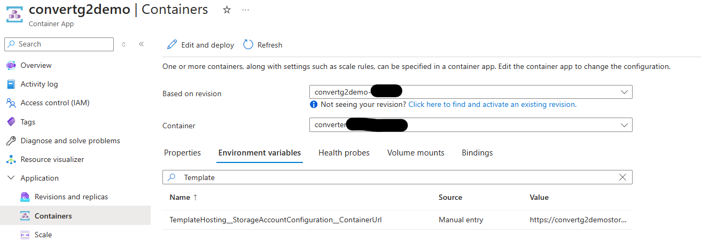
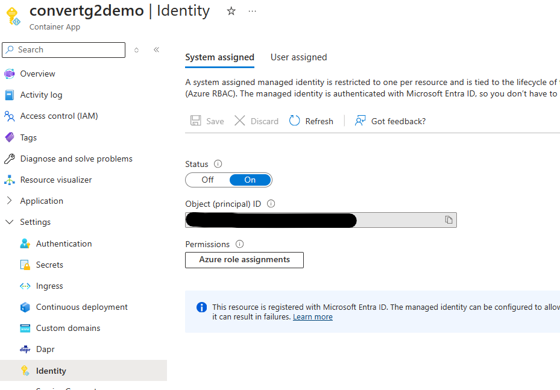
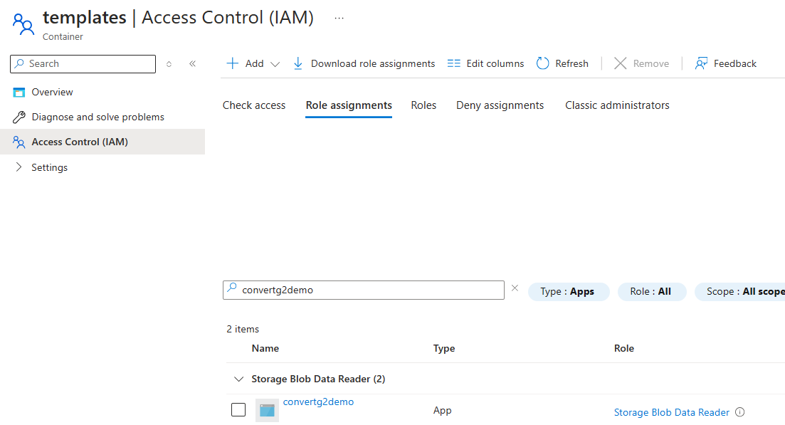
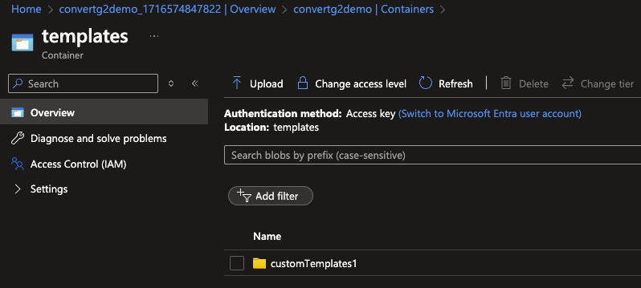
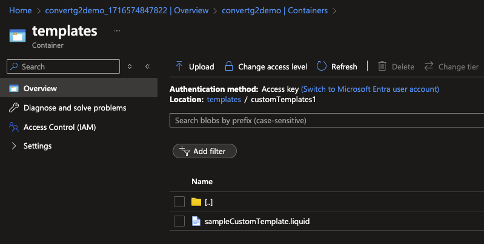

# Template Store Integration

This how-to-guide shows you how to configure the template store for the FHIR converter service in Azure. This is needed to support the ability to use custom Liquid templates for your conversion requests.

The service currently supports integration with Azure Storage Accounts to pull custom templates hosted within the blob container.

If you are using the quickstart version of the [deployment options](deployment-options.md#default-settings) with default settings, your FHIR converter service will be configured to use the provided default templates. To configure your service to pull custom templates from a new or pre-existing Storage Account, follow the steps in this document.

## Template store settings overview

The configurable template store settings are :

```json
{
  "TemplateHosting": {
    "StorageAccountConfiguration": {
      "ContainerUrl": ""
    }
  }
}
```

| Element                    | Description |
| -------------------------- | --- |
| StorageAccountConfiguration:ContainerUrl | The URL of the storage account blob container containing the Liquid templates. |

## Configure storage account details

### Prerequisites

To configure your template store with your FHIR converter service, you need to have an Azure Storage Account created with a blob container. Refer [Create a Storage Account](https://learn.microsoft.com/en-us/azure/storage/common/storage-account-create?tabs=azure-portal) for instructions to create one manually, or see [Configure your FHIR converter service for template store integration](#configure-your-fhir-converter-service-for-template-store-integration) below for details on using one of the provided deployment options to create a Storage Account and blob container and integrating them with your FHIR converter service.

The custom Liquid templates need to be uploaded to the Storage Account blob container that will be configured with the service.
For guidance on how to create custom Liquid templates, refer [Customize templates](customize-templates.md).

### Configure your FHIR converter service for template store integration

There are two options for configuring your FHIR converter to pull templates from a given Storage Account:

  1. Use one of the provided deployment options outlined in [Deployment Options](deployment-options.md) to either deploy or redeploy your FHIR converter service, providing values for the following parameters:

    | Parameter | Description |
    | --- | --- |
    | templateStoreIntegrationEnabled | This must be set to true to enable use of custom templates. |
    | templateStorageAccountName | Name of the Storage Account from which to pull the custom templates. This can be set to a custom name, or it can be left blank to use an automatically calculated value. If no Storage Account exists with the provided name, a new one will be provisioned.|
    | templateStorageAccountContainerName | Name of the blob container from which to pull the custom templates. This can be set to a custom name, or it can be left blank to use the default value. If no blob container exists with the provided custom name, a new one will be provisioned.|

  2. Alternatively, if you already have a deployed Storage Account and blob container that you you can directly provide the configuration via environment variables in your Azure Container App running the FHIR converter service by editing the container:
      1. ```TemplateHosting__StorageAccountConfiguration__ContainerUrl```: the blob container URL hosting the custom templates.

        Refer [Configure environment variables](https://learn.microsoft.com/en-us/azure/container-apps/environment-variables?tabs=portal) for more information.

      

### Grant permissions to the Storage Account

In order for the service to be able to load the custom templates from the Storage Account, the Azure Container App running the service needs to be granted appropriate permissions to read from the Storage Account.

1. Enable managed identity on your Azure Container App.
    * Your container app can be granted either a system-assigned identity or a user-assigned identity.

   Refer [Managed Identities in Azure Container Apps](https://learn.microsoft.com/en-us/azure/container-apps/managed-identity?tabs=portal%2Cdotnet) for more information.



1. Assign the identity created above,[`Storage Blob Data Reader`](https://learn.microsoft.com/en-us/azure/role-based-access-control/built-in-roles/storage#storage-blob-data-reader) role priveleges on the Storage Account container being configured with the service.

   Refer [Assign an Azure role for access to blob data](https://learn.microsoft.com/en-us/azure/storage/blobs/assign-azure-role-data-access?tabs=portal) for more information.



### Verify template store health check

To verify your FHIR converter service is set up correctly to pull the custom templates from the configured storage account, use the below health check endpoint:

**GET `https://<CONTAINER APP ENDPOINT URL>/health/check`**

Sample response body

```json
{
    "overallStatus": "Healthy",
    "details": [
        {
            "name": "TemplateStoreHealthCheck",
            "status": "Healthy",
            "description": "Sucessfully connected to blob template store.",
            "data": {}
        }
    ]
}
```

## Uploading Custom Templates to the Storage Account

Templates should be uploaded to the blob container as ```.liquid``` files. They can be stored in the root of the container, or organized into directories. The value passed in to the ```RootTemplateName``` field of the request body represents the path of the template file from the root of the blob container.

For example, if the user intends to reference a custom template called ```sampleCustomTemplate.liquid```, which is located within the ```customTemplates1``` directory inside the ```template``` Storage Blob, as shown below, the ```RootTemplateName``` should have value ```customTemplates1/sampleCustomTemplate```.





## Summary

In this how-to-guide, you learned how to configure the template store settings for the FHIR converter service to be able to use custom Liquid templates for conversion.

To get started with your FHIR converter service, refer to the following documents:

* [Customize Liquid templates](customize-templates.md)
* [Use FHIR converter APIs](use-convert-web-apis.md)
* [Monitor FHIR converter service](monitoring.md)
