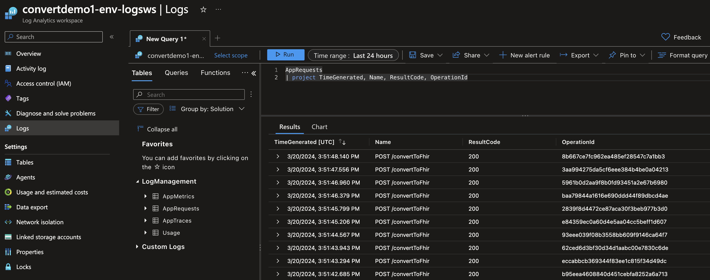
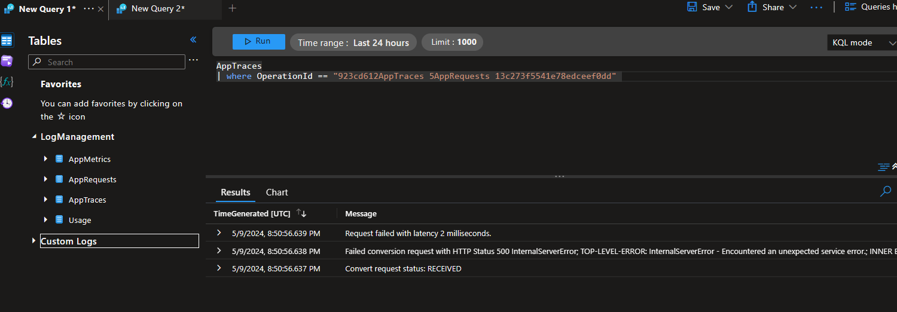
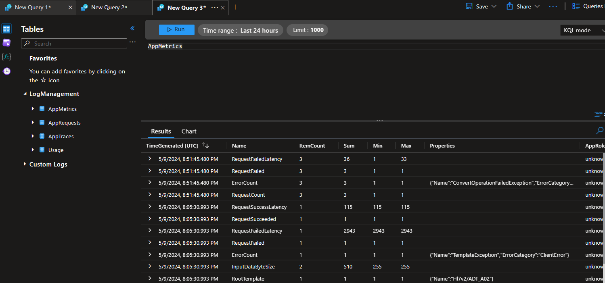
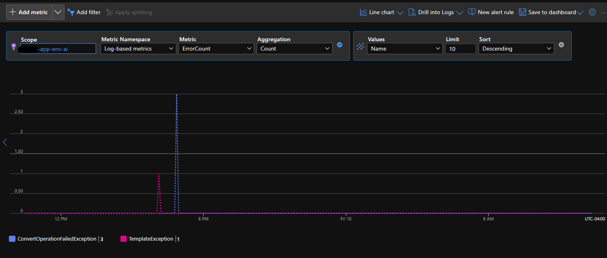
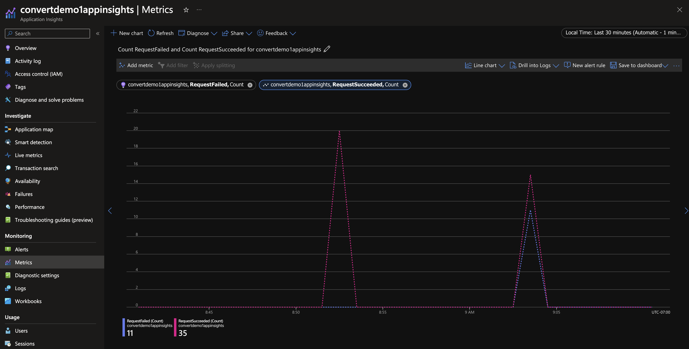
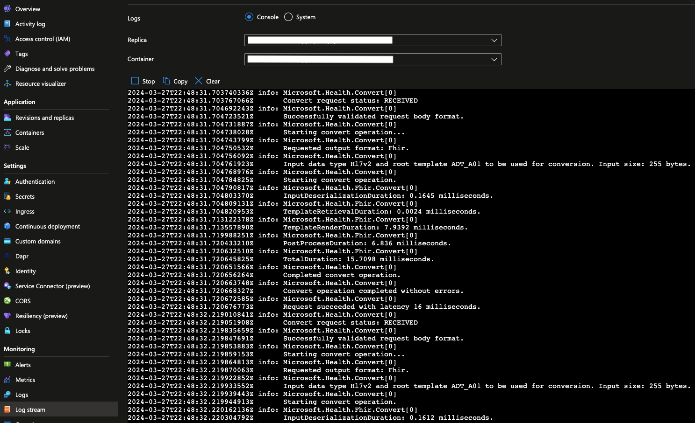

# Monitoring

The FHIR converter APIs generate custom logs and metrics when invoked, which can be utilized for gaining insights or aiding in troubleshooting.

If you have deployed your FHIR converter service using the provided [deployment options](deployment-options.md), a Log Analytics workspace and Application Insights resource will be created by default. The authentication with the application insights instance is set up such that only telemetry from authorized container apps reaches the application insights instance before being forwarded to the log analytics workspace.

## Telemetry

In the context of the FHIR converter service, telemetry data is categorized into three main types: Requests, Traces, and Metrics.

### Requests

The request telemetry provides detailed information about the API requests made to the FHIR converter service. This includes data such as the time of the request, the endpoint hit, the HTTP method used, the status code returned, the duration of the request and the operation id associated with the request.

This data can be used to monitor the overall health of the service, identify patterns in usage, and detect potential issues. For example, a high number of 4xx or 5xx status codes could indicate a problem with the service or the requests being made.

### Traces

Trace telemetry provides detailed diagnostic information during the execution of the FHIR converter API. This includes data such as the trace message with the precise time stamp, and the operation id associated with the trace.

Trace data can be used to debug and diagnose issues with the service. For example, if an API request fails, you can use the trace data to determine the sequence of events that led to the failure and identify the root cause.

### Metrics

Metrics telemetry provides quantitative data about the operation of the FHIR converter service, which can be used to monitor the performance and usage of the service.
The following custom metrics are emitted upon usage of FHIR converter APIs:

| Name                    | Description                                                 | Dimensions          |
| ----------------------- | ------------------------------------------------------------|---------------------|
| RequestCount            | Total number of API requests made.                          |                     |
| RequestSucceeded        | Total number of successful API requests.                    |                     |
| RequestFailed           | Total number of failed API requests.                        |                     |
| RequestSuccessLatency   | Total latency of a successful API request.                  |                     |
| RequestFailedLatency    | Total latency of a failed API request.                      |                     |
| InputDataByteSize       | Size of the InputData in bytes.                             |                     |
| InputDataType           | The InputDataFormat specified in the API request.           | Name                |
| OutputDataType          | The OutputDataFormat of the result of the API request.      | Name                |
| RootTemplate            | The RootTemplateName specified in the API request.          | Name                |
| ErrorCount              | Total number of errors encountered during the API requests. | Name, ErrorCategory |

## Accessing Telemetry

### Log Analytics

Telemetry can be accessed from [Log Analytics](https://learn.microsoft.com/azure/container-apps/log-monitoring?tabs=bash#query-log-with-log-analytics), either via the Log Analytics workspace resource created, or from the Azure Monitor Logs integrated within your Azure Container App.

* You can query enriched request, metric, and trace logs under the **LogManagement** category in the Logs blade, using the ```AppRequests```, ```AppMetrics```, and ```AppTraces``` tables, respectively.

     For more in-depth debugging, each log in the ```AppTraces``` table can be associated to a request in the ```AppRequests``` table through a matching ```OperationId``` value.

    
    
    

  * Sample KQL queries for trace and request telemetry:

    ```KQL
    // get the operation_id and result of each request
    AppRequests
    | where TimeGenerated > ago(12hours)
    | project TimeGenerated, Name, ResultCode, OperationId
    
    // get the error details of a failed request
    AppTraces
    | where OperationId == "<enter-operation-id>"
    | where Message contains "Convert operation failed"
    
    // get the latency of each step of the convert operation for a given request
    AppTraces
    | where OperationId == "<enter-operation-id>"
    | where Properties contains "Metric" and Properties contains "Duration"
    | project OperationId, Metric = tostring(Properties.Metric), Latency = tostring(Properties.Duration)
    ```

  * Sample KQL queries for metrics:

    > [!Note]
    > Azure Monitor aggregates metrics, so entries in th `AppMetrics` table cannot each be associated with an individual request - [more info](https://learn.microsoft.com/en-us/azure/azure-monitor/essentials/metrics-aggregation-explained)

    ```KQL
    // get the number of total requests, successful requests, and failed requests
    AppMetrics
    | where TimeGenerated > ago(1hour)
    | where Name == "RequestCount" or Name == "RequestSucceeded" or Name == "RequestFailed"
    | summarize Count = count() by Name
        
    // get the total number of failed requests by exception type, where the error is a client error
    AppMetrics
    | where TimeGenerated > ago(6hour)
    | where tostring(Properties.ErrorCategory) == "ClientError"
    | summarize Count = count() by ExceptionType = tostring(Properties.Name)
    ```

* You can query the raw console logs and system logs under the **CustomLogs** category in the Logs blade, using  using the tables `ContainerAppConsoleLogs_CL` and `ContainerAppSystemlogs_CL`, respectively.

### Application Insights

Application Insights provides various experiences to gather insights on the performance, reliability, and quality of your applications. Refer [this](https://learn.microsoft.com/en-us/azure/azure-monitor/app/app-insights-overview) to learn more about all the different monitoring views and additional telemetry available.

* Custom service metrics - To view the metrics emitted by your FHIR converter service in a graphical format,  when creating graphs in the Metrics blade:
  * Metric Namespace: Select `Log-based metrics`
  * Metric: Scroll to the `Custom` category and select the metric.
  * Aggregration: Choose the type of aggregration you want to view the metric data with.
  * Apply splitting: For metrics that have dimensions, you can `Apply splitting` on the specific dimension to get more granular information for the metric.

    
    

### Log Stream

The raw console logs emitted by the FHIR converter service as well as the system logs emitted by the container app, can be viewed using the built-in [Log Stream](https://learn.microsoft.com/azure/container-apps/log-streaming?tabs=bash) in Azure Container App.

  

### Additional information

* Azure Container Apps provides several built-in observability features to give insights on your container app's health and performance. For example, this can be used to monitor CPU usage, memory usage, traffic bottlenecks; diagnose issues with revision deployment, responsiveness, etc.

    Refer [this](https://learn.microsoft.com/en-us/azure/container-apps/observability) for more information.

## Summary

In this how-to-guide, you learned how to monitor your FHIR converter service in Azure and gain insights into the usage of the APIs.

To troubleshoot any errors reported by the service, refer to the following documents:

* [Troubleshooting guide](troubleshoot.md)
