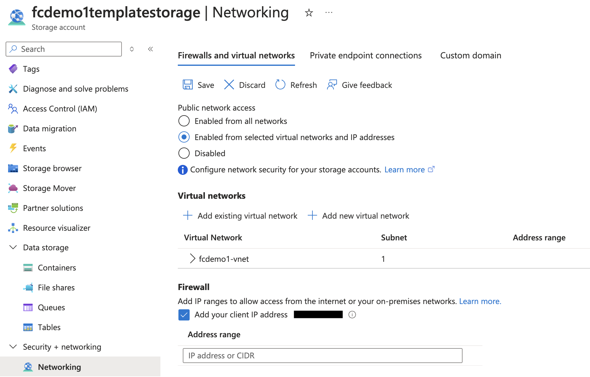

# Storage Account Network Isolation

To optionally enhance the security of your template Storage Account, you can add a Virtual Network to your FHIR Converter infrastructure that is used to enforce network isolation on your Storage Account. This involves provisioning the Container Apps environment in the Virtual Network and only allowing resources within the Virtual Network to access the Storage Account. To learn more about Storage Account network isolation, see [Configure Azure Storage firewalls and virtual networks](https://learn.microsoft.com/en-us/azure/storage/common/storage-network-security?tabs=azure-cli#how-to-approach-network-security-for-your-storage-account).

# Deployment Options

The following are sample deployment commands for enabling Storage Account network isolation, using deployment option 2 or 3, as described in [Deployment options to set up FHIR converter service in Azure](deployment-options.md):

Option 2 (bicep):
```
az deployment sub create --location <Location> --name <A custom name for your deployment> --template-file FhirConverter-SingleAzureDeploy.bicep --parameters templateStoreIntegrationEnabled=true storageAccountNetworkIsolationEnabled=true
```

Option 3 (PowerShell):
```PowerShell
./FhirConverter-SingleAzureDeploy.ps1 -templateStoreIntegrationEnabled $true -storageAccountNetworkIsolationEnabled $true
```

# Virtual Network and Subnet address blocks

As part of the Virtual Network deployment, CIDR address spaces must be specified for the Virtual Network and its subnet(s). By default, the deployment tools described in [Deployment options to set up FHIR converter service in Azure](deployment-options.md) will set these values to address spaces that should be appropriate. In certain cases, however, such as having multiple Virtual Networks within your organization, these default values might not be compatible with your specific setup and may result in routing issues. The following list outlines key considerations when choosing your Virtual Network and subnet address spaces:

- The Virtual Network address space must not overlap with your organization's other network ranges (see [Azure Virtual Networks concepts and best practices](https://learn.microsoft.com/en-us/azure/virtual-network/concepts-and-best-practices)).
- The subnet address spaces must be within the Virtual Network address space, but a single subnet must not take up the entire address space of the Virtual Network (see more information on subnet design considerations [here](https://learn.microsoft.com/en-us/azure/container-apps/networking?tabs=consumption-only-env%2Cazure-cli#subnet)).
- The subnet needs to be dedicated exclusively to the Container Apps environment.
- The minimum subnet size is ```/23``` and the subnet address spaces must not overlap with any of ```169.254.0.0/16```, ```172.30.0.0/16```, ```172.31.0.0/16```, or ```192.0.2.0/24```. The subnet size cannot be modified after Container Apps environment creation (see more details on Virtual Network integration with Container Apps environments [here](https://learn.microsoft.com/en-us/azure/container-apps/networking?tabs=workload-profiles-env%2Cazure-cli)).

Further information on designing Virtual Networks can be found [here](https://learn.microsoft.com/en-us/azure/virtual-network/virtual-network-vnet-plan-design-arm).

# Template Upload

If you have network isolation enabled on your Storage Account, you must manually configure a Firewall rule on your Storage Account to allow your Azure Portal client IP address access to the Storage Account so that you can upload templates to the Storage Account. To do so, first navigate to your Storage Account and click on the ```Networking``` blade under ```Security + networking```. Then in the ```Firewalls and virtual networks``` tab, under the ```Firewall``` section of the page, check the box next to "Add your client IP address" and press ```Save```. This will allow you to upload templates manually from your specific Azure Portal client.

