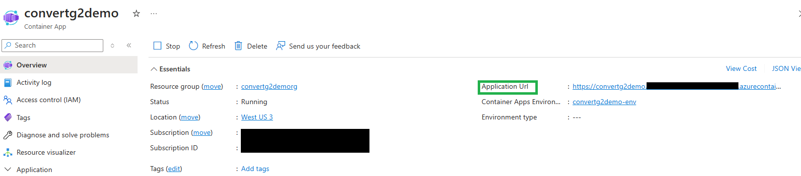

# Use FHIR converter APIs

This how-to-guide explains how to use the FHIR converter APIs using the service deployed to Azure.

## Prerequisites

In order to use the FHIR converter APIs, you must have an instance of the FHIR converter service deployed to Azure.

Refer [Setup FHIR converter Service](setup-convert-service.md) for detailed instructions to create a web service to target your conversion requests to.

## FHIR converter Endpoint

If you have setup your FHIR converter service using the provided [deployment options](deployment-options.md), an Azure Container App is deployed to run the FHIR converter container and serves as the web service that clients can send conversion requests to.

### Service URL

The service URL to target corresponds to the application URL of the Azure Container App running the service.



### API versions

The version of the REST API must be explicitly specified in the request URL in a query parameter `api-version`, as shown in the following example:

`https://<service_url>/<api>?api-version=<version>`

#### Supported versions

Currently the supported versions are:

* 2024-05-01-preview

A list of supported versions for the requested API is returned as a response header `api-supported-versions`.

### APIs

#### Swagger

The swagger document for the supported versions can be found at the following url:

GET `https://<service_url>/<api-version>/swagger.yaml`

#### Health check

The health status of the service which indicates if the service is configured correctly and is running and available to service requests, can be queried using the following API:

GET `https://<service_url>/health/check`

* Sample response body

```json
    {
     "overallStatus": "Healthy",
     "details": [
      {
       "name": "TemplateStoreHealthCheck",
       "status": "Healthy",
       "description": "Sucessfully connected to blob template store.",
       "data": {}
      }
     ]
    }

```

#### Convert to FHIR R4

Supports conversion of legacy healthcare formats such as Hl7v2, C-CCDA, Json and FHIR STU3 to FHIR R4 format.

* API Route: `convertToFhir`

* Request parameters

| Name | Optionality | Default | Description | Accepted values |
| ----- | ----- | ----- |----- |----- |
| InputDataFormat | Required | - | Type of data input. | `Hl7v2`, `Ccda`, `Json`, `Fhir_STU3` |
| RootTemplateName | Required | - | Name of root template to be used for conversion. | For use of **default templates**, this will be the name of template provided in [here](https://github.com/microsoft/FHIR-Converter/tree/main/data/Templates) for each of the supported data formats.<br><br> **HL7v2 to FHIR** (57 templates): "ADT_A01", "ADT_A02", "ADT_A03", "ADT_A04", "ADT_A05", "ADT_A06". "ADT_A07", "ADT_A08", "ADT_A09", "ADT_A10", "ADT_A11", "ADT_A13", "ADT_A14", "ADT_A15", "ADT_A16", "ADT_A25", "ADT_A26", "ADT_A27", "ADT_A28", "ADT_A29", "ADT_A31", "ADT_A40", "ADT_A41", "ADT_A45", "ADT_A47", "ADT_A60", "BAR_P01", "BAR_P02", "BAR_B12", "DFT_P03", "DFT_P11", "MDM_T01", "MDM_T02", "MDM_T05", "MDM_T06", "MDM_T09", "MDM_T10", "OMG_O19" "OML_O21", "ORM_O01", "ORU_R01", "OUL_R22", "OUL_R23", "OUL_R24", "RDE_O11", "RDE_O25", "RDS_O13", "REF_I12", "REF_I14", "SIU_S12", "SIU_S13", "SIU_S14", "SIU_S15", "SIU_S16", "SIU_S17", "SIU_S26", "VXU_V04" <br><br>**C-CDA to FHIR** (9 templates): "CCD", "ConsultationNote", "DischargeSummary", "HistoryandPhysical", "OperativeNote", "ProcedureNote", "ProgressNote", "ReferralNote", "TransferSummary" <br><br> **JSON to FHIR**: "Stu3ChargeItem", "ExamplePatient" <br> (*These JSON templates are sample templates for use, not default templates that adhere to any pre-defined JSON message types. JSON does not have any standardized message types, unlike HL7v2 messages or C-CDA documents. Therefore, instead of "default" templates we provide you with some sample templates that you can use as a starting guide for you to modify and customize.*) <br><br> **FHIR STU3 to R4**: Name of the root template that is the same as the STU3 resource name e.g., "Patient", "Observation", "Organization". Some of the STU3 resources are renamed or removed from R4. Please refer to [Resource differences and constraints for STU3 to R4](docs/Stu3R4-resources-differences.md).<br><br> For use of **custom templates**, this will be the name of the blob file containing the Liquid template in the storage account configured with this service. The path to the blob file relative to the blob container must be specified. <br> For instance, if the template named "ADT_A01" exists in a folder in the container named "Hl7v2", the value should include the folder path - "Hl7v2/ADT_A01" |
| InputDataString | Required | - | Input data content to be converted in string format. | String representation of the data to be converted. |

* Response body

The API response is a json object which contains the converted FHIR bundle under the `result` property.

* Sample:

  POST `https://<service_url>/convertToFhir?api-version=<version>`

  Request Body

  ```json
    {
        "InputDataFormat": "Hl7v2",
        "RootTemplateName": "ADT_A01",
        "InputData": "MSH|^~\\&|SIMHOSP|SFAC|RAPP|RFAC|20200508131015||ADT^A01|517|T|2.3|||AL||44|ASCII\nEVN|A01|20200508131015|||C005^Whittingham^Sylvia^^^Dr^^^DRNBR^PRSNL^^^ORGDR|\nPID|1|3735064194^^^SIMULATOR MRN^MRN|3735064194^^^SIMULATOR MRN^MRN~2021051528^^^NHSNBR^NHSNMBR||"
    }
  ```

  Response Body

  ```json
    {
        "result": {
            "resourceType": "Bundle",
            "type": "batch",
            "timestamp": "2020-05-08T13:10:15Z",
            "identifier": {
                "value": "517"
            },
            "id": "7dcb7d92-7a75-3d65-42f9-0f790afac4db",
            "entry": [
                {
                    "fullUrl": "urn:uuid:aa521dd9-b613-0210-a661-82ce17e38fb3",
                    "resource": {
                        "resourceType": "MessageHeader",
                        "id": "aa521dd9-b613-0210-a661-82ce17e38fb3",
                        "source": {
                        "name": "SIMHOSP",
                        "_endpoint": {
                        "extension": [
                        {
                            "url": "http://hl7.org/fhir/StructureDefinition/data-absent-reason",
                            "valueCode": "unknown"
                        }
                        ]
                        }
                        },
                    ....
                    ....
                    },
                }
            ]
        }
    }
  ```

#### Convert to HL7v2

Supports conversion of FHIR R4 data to HL7v2 format.

* API Route: `convertToHl7v2`

* Request parameters

| Name | Optionality | Default | Description | Accepted values |
| ----- | ----- | ----- |----- |----- |
| InputDataFormat | Required | - | Type of data input. | `Fhir` |
| RootTemplateName | Required | - | Name of root template to be used for conversion. | For use of **default templates**, this will be the name of template provided in [here](https://github.com/microsoft/FHIR-Converter/tree/main/data/Templates) for each of the supported data formats.<br><br> **FHIR to HL7v2** : **TODO add references**(*These JSON templates are sample templates for use, not default templates that adhere to any pre-defined JSON message types. JSON does not have any standardized message types, unlike HL7v2 messages or C-CDA documents. Therefore, instead of "default" templates we provide you with some sample templates that you can use as a starting guide for you to modify and customize.*).<br><br> For use of **custom templates**, this will be the name of the blob file containing the Liquid template in the storage account configured with this service. The path to the blob file relative to the blob container must be specified. <br> For instance, if the template named "BundleToHL7v2" exists in a folder in the container named "Fhir", the value should include the folder path - "Fhir/BundleToHL7v2" |
| InputDataString | Required | - | Input data content to be converted in string format. | String representation of the data to be converted. |

* Response body

The API response is a json object which contains the converted HL7v2 message under the `result` property.

* Sample:

  POST `https://<service_url>/convertToHl7v2?api-version=<version>`

  Request Body

  ```json
    {
        "InputDataFormat": "Fhir",
        "RootTemplateName": "Fhir/BundleToHL7v2",
        "InputData": "InputDataString": "{\"resourceType\":\"Bundle\",\"id\":\"bundle-response-medsallergies\",\"type\":\"batch-response\",\"entry\":[{\"resource\":{\"resourceType\":\"Patient\",\"id\":\"example\",\"meta\":{\"versionId\":\"1\",\"lastUpdated\":\"2018-11-12T03:35:20.715Z\"},\"identifier\":[{\"use\":\"usual\",\"type\":{\"coding\":[{\"system\":\"http://terminology.hl7.org/CodeSystem/v2-0203\",\"code\":\"MR\"}]},\"system\":\"urn:oid:1.2.36.146.595.217.0.1\",\"value\":\"12345\",\"period\":{\"start\":\"2001-05-06\"},\"assigner\":{\"display\":\"AcmeHealthcare\"}}],\"active\":true,\"name\":[{\"use\":\"official\",\"family\":\"Chalmers\",\"given\":[\"Peter\",\"James\"]},{\"use\":\"usual\",\"given\":[\"Jim\"]},{\"use\":\"maiden\",\"family\":\"Windsor\",\"given\":[\"Peter\",\"James\"],\"period\":{\"end\":\"2002\"}}],\"telecom\":[{\"use\":\"home\"},{\"system\":\"phone\",\"value\":\"(03)55556473\",\"use\":\"work\",\"rank\":1},{\"system\":\"phone\",\"value\":\"(03)34105613\",\"use\":\"mobile\",\"rank\":2},{\"system\":\"phone\",\"value\":\"(03)55558834\",\"use\":\"old\",\"period\":{\"end\":\"2014\"}}],\"gender\":\"male\",\"birthDate\":\"1974-12-25\",\"_birthDate\":{\"extension\":[{\"url\":\"http://hl7.org/fhir/StructureDefinition/patient-birthTime\",\"valueDateTime\":\"1974-12-25T14:35:45-05:00\"}]},\"deceasedBoolean\":false,\"address\":[{\"use\":\"home\",\"type\":\"both\",\"text\":\"534ErewhonStPeasantVille,Rainbow,Vic3999\",\"line\":[\"534ErewhonSt\"],\"city\":\"PleasantVille\",\"district\":\"Rainbow\",\"state\":\"Vic\",\"postalCode\":\"3999\",\"period\":{\"start\":\"1974-12-25\"}}],\"contact\":[{\"relationship\":[{\"coding\":[{\"system\":\"http://terminology.hl7.org/CodeSystem/v2-0131\",\"code\":\"N\"}]}],\"name\":{\"family\":\"duMarché\",\"_family\":{\"extension\":[{\"url\":\"http://hl7.org/fhir/StructureDefinition/humanname-own-prefix\",\"valueString\":\"VV\"}]},\"given\":[\"Bénédicte\"]},\"telecom\":[{\"system\":\"phone\",\"value\":\"+33(237)998327\"}],\"address\":{\"use\":\"home\",\"type\":\"both\",\"line\":[\"534ErewhonSt\"],\"city\":\"PleasantVille\",\"district\":\"Rainbow\",\"state\":\"Vic\",\"postalCode\":\"3999\",\"period\":{\"start\":\"1974-12-25\"}},\"gender\":\"female\",\"period\":{\"start\":\"2012\"}}],\"managingOrganization\":{\"reference\":\"Organization/1\"}}},{\"resource\":{\"resourceType\":\"Observation\",\"id\":\"f001\",\"identifier\":[{\"use\":\"official\",\"system\":\"http://www.bmc.nl/zorgportal/identifiers/observations\",\"value\":\"6323\"}],\"status\":\"final\",\"code\":{\"coding\":[{\"system\":\"http://loinc.org\",\"code\":\"15074-8\",\"display\":\"Glucose[Moles/volume]inBlood\"}]},\"subject\":{\"reference\":\"Patient/f001\",\"display\":\"P.vandeHeuvel\"},\"effectiveDateTime\":\"2013-04-02T09:30:10+01:00\",\"issued\":\"2013-04-03T15:30:10+01:00\",\"performer\":[{\"reference\":\"Practitioner/f005\",\"display\":\"A.Langeveld\"}],\"valueQuantity\":{\"value\":6.3,\"unit\":\"mmol/l\",\"system\":\"http://unitsofmeasure.org\",\"code\":\"mmol/L\"},\"interpretation\":[{\"coding\":[{\"system\":\"http://terminology.hl7.org/CodeSystem/v3-ObservationInterpretation\",\"code\":\"H\",\"display\":\"High\"}]}],\"referenceRange\":[{\"low\":{\"value\":3.1,\"unit\":\"mmol/l\",\"system\":\"http://unitsofmeasure.org\",\"code\":\"mmol/L\"},\"high\":{\"value\":6.2,\"unit\":\"mmol/l\",\"system\":\"http://unitsofmeasure.org\",\"code\":\"mmol/L\"}}]}},{\"resource\":{\"resourceType\":\"Observation\",\"id\":\"f001\",\"identifier\":[{\"use\":\"official\",\"system\":\"http://www.bmc.nl/zorgportal/identifiers/observations\",\"value\":\"6324\"}],\"status\":\"final\",\"code\":{\"coding\":[{\"system\":\"http://loinc.org\",\"code\":\"11111-1\",\"display\":\"Another test\"}]},\"subject\":{\"reference\":\"Patient/f001\",\"display\":\"P.vandeHeuvel\"},\"effectiveDateTime\":\"2013-04-02T09:30:10+01:00\",\"issued\":\"2013-04-03T15:30:10+01:00\",\"performer\":[{\"reference\":\"Practitioner/f005\",\"display\":\"A.Langeveld\"}],\"valueQuantity\":{\"value\":8.0,\"unit\":\"mmol/l\",\"system\":\"http://unitsofmeasure.org\",\"code\":\"mmol/L\"},\"interpretation\":[{\"coding\":[{\"system\":\"http://terminology.hl7.org/CodeSystem/v3-ObservationInterpretation\",\"code\":\"H\",\"display\":\"High\"}]}],\"referenceRange\":[{\"low\":{\"value\":3.1,\"unit\":\"mmol/l\",\"system\":\"http://unitsofmeasure.org\",\"code\":\"mmol/L\"},\"high\":{\"value\":6.2,\"unit\":\"mmol/l\",\"system\":\"http://unitsofmeasure.org\",\"code\":\"mmol/L\"}}]}}]}"
    }
  ```

  Response Body

  ```json
    {
        "result": "FHS|^~\\&|TestSystem|\nBHS|^~\\&|TestSystem|\nMSH|^~\\&|TestSystem||TransformationAgent||123||ORU^R01|1|T|2.5|\nPID|||12345|\nOBR||6323|15074-8^Glucose[Moles/volume]inBlood^LN||||||||||||||||||||||F|\nOBX|||||6.3|mmol/l|3.1-6.2|H|\nMSH|^~\\&|TestSystem||TransformationAgent||123||ORU^R01|1|T|2.5|\nPID|||12345|\nOBR||6324|11111-1^Another test^LN||||||||||||||||||||||F|\nOBX|||||8|mmol/l|3.1-6.2|H|\nBTS|1|\nFTS|1|\n"
    }
  ```

### Samples

* [Insomnia](https://insomnia.rest/) is a tool to debug and test APIs. Once you download it, refer [API Collection Examples](../samples/APICollectionEamples) to try some test conversion requests.

  * Import [Insomnia-Examples.json](../samples/APICollectionEamples/Insomnia-Examples.json) template in Insomnia.
  * Provide the values for the "Base Environment" variables:
    * `serviceUrl` with your service endpoint. Refer [Service URL](#service-url).
    * `api-version` with the api version to target for your requests. Refer [API versions](#api-versions).

* Refer [sample messages](../samples/Messages/) for sample healthcare messages to test with.

## Summary

In this how-to-guide, you learned how to use the FHIR converter APIs against the service endpoint setup in Azure, to be able to perform health data conversions.

To monitor/troubleshoot your service, refer to the following documents:

* [Monitor FHIR converter service](monitoring.md)
* [Troubleshooting guide](troubleshoot.md)
