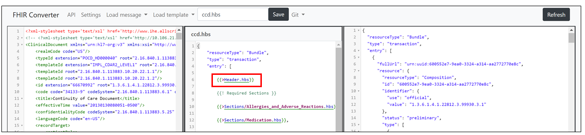

# C-CDA template creation 

The C-CDA templates included in this release were generated from customer feedback. For C-CDA, we have top level templates for Care Plan, CCD, Consultation Note, Discharge Summary, History and Physical, Operative Note, Procedure Note, Progress Note, Referral Note and Transfer Summary. We will add more templates as we receive more customer feedback.

## Tips for creating C-CDA templates 

As part of the C-CDA converter release, we have provided partial templates for many of the sections found in various CCD documents. These partial templates are available under the Sections folder. We recommend taking advantage of these partial templates to construct your top level template. For example, in the ccd.hbs top level template, you can see partial templates both for the required sections and optional sections in the CCD document.

As part of the templates provided for the C-CDA converter, we have also included a Header.hbs partial template. The Header section is the root XML element and is present in every CCDA document. It helps identify and classify documents via basic information about them. The Header.hbs partial template can be used in any top level template to convert the header section in a CDA document to FHIR. 

