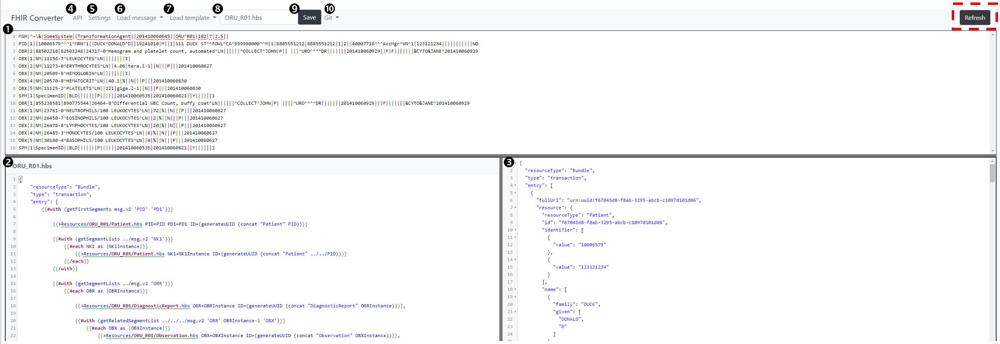

# Web UI Summary

To edit templates, the open-source release includes a Web UI. Below is a screenshot of the web UI with an overview of the key functionality.

| Area | Overview of Functionality |
|------|---------------------------|
| 1 | Displays the HL7 v2 message being converted. You can paste in any HL7 v2 into the message box or load new messages into the sample messages to make them available in the drop down in #6 |
| 2 | json template based on selection in #7 and displayed in #8. The template can be edited in this window. |
| 3 | FHIR bundle output of the message in #1 using the json template in #2 |
| 4 | UI rendering of the swagger to see details on all available APIs. This will load in a new page |
| 5 | Displays settings available in the UI. Currently the available settings are **scroll sync** (on by default) and **dark mode** (off by default). |
| 6 | Location to select pre loaded test messages for testing the template and conversion |
| 7 | Location to select available templates |
| 8 | Shows which template is currently being displayed in #2 and allows you to rename templates for saving |
| 9 | Allows you to save updates to the template being displayed in #2 and #8 |
| 10 | Allows you to create a new branch for updating templates, switch between branches, and commit the current branch |
| Refresh | Brings any updates that you made in a parallel session into this session. For example, if you have two sessions open side by side and modify a template in one, you won’t see the update in the other until selecting refresh. Note that refresh will not reload any open templates.  To ensure you get all changes, close all open templates in the session and then hit refresh. |
